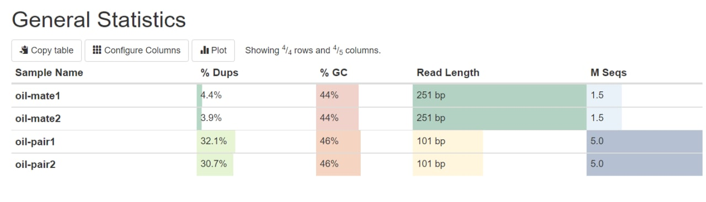
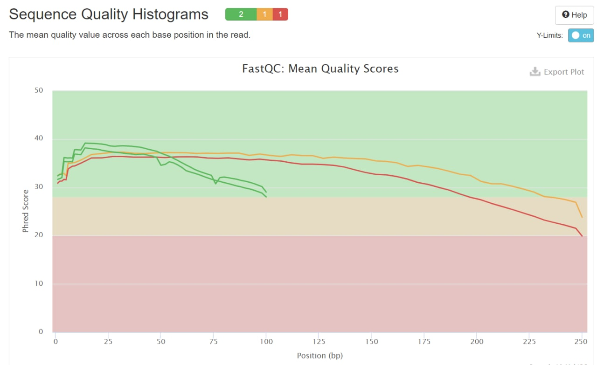
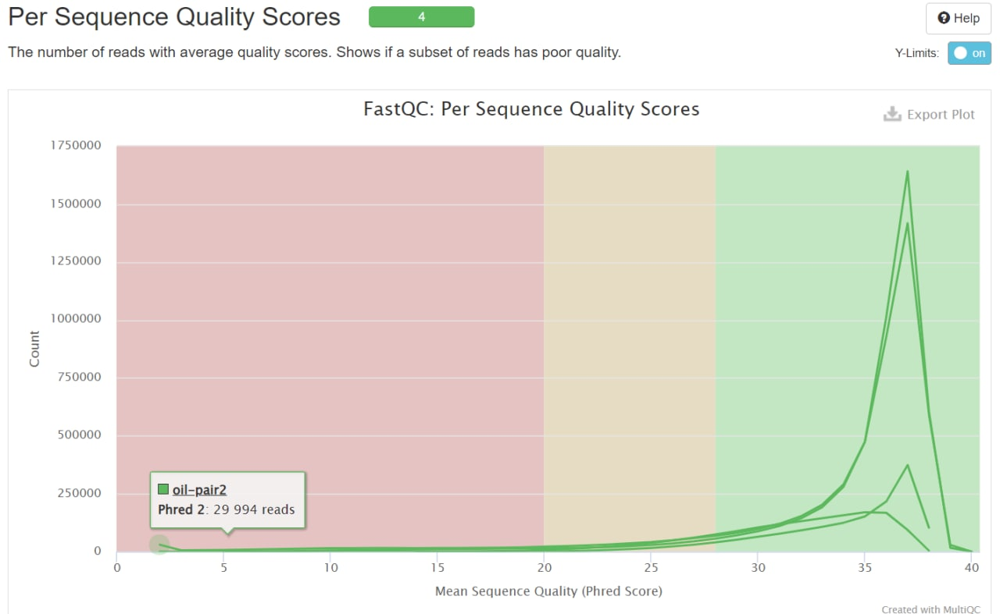
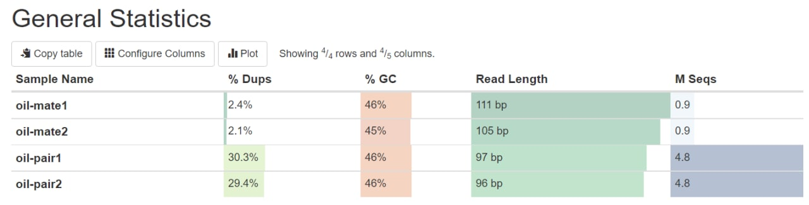
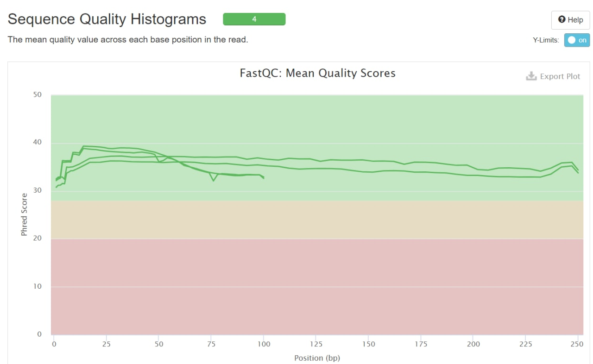
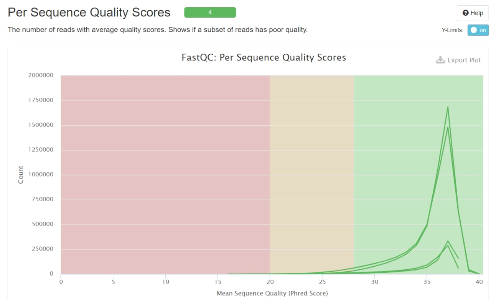

### Создадим символические ссылки на файлы при помощи команд

ln -s /usr/share/data-minor-bioinf/assembly/oil_R1.fastq

ln -s /usr/share/data-minor-bioinf/assembly/oil_R2.fastq

ln -s /usr/share/data-minor-bioinf/assembly/oilMP_S4_L001_R1_001.fastq

ln -s /usr/share/data-minor-bioinf/assembly/oilMP_S4_L001_R2_001.fastq

### Выберем из них случайные чтения

seqtk sample -s306 oil_R1.fastq 5000000 > oil-pair1.fastq

seqtk sample -s306 oil_R1.fastq 5000000 > oil-pair2.fastq

seqtk sample -s306 oilMP_S4_L001_R1_001.fastq 1500000 > oil-mate1.fastq

seqtk sample -s306 oilMP_S4_L001_R1_001.fastq 1500000 > oil-mate2.fastq

### Оценим качество при помощи fastqc и multiqc

fastqc oil-pair*

fastqc oil-maate*

multiqc .

Получим следующие результаты

### Теперь подрежем чтения при помощи platanus и еще раз оценим качество

platanus_trim oil-pair1.fastq oil-pair2.fastq

platanus_internal_trim oil-mate1.fastq oil-mate2.fastq

Можно заметить, что длины чтений oil-mate уменьшились больше, чем в два раза, тогда как длины чтений oil-pair почти не изменились. При этом среднее качество прочтений значительно улучшилось после обрезания.

### Соберем контиги при помощи platanus assemble

platanus assemble -f oil-pair1.fastq.trimmed oil-pair2.fastq.trimmed

Получили файл out_contig.fa

Анализ контигов в jupyter-notebook дает следующие результаты

Кол-во контигов: 599

Длина самого большого контига: 179307

Суммарная длина контигов: 3924360

N50: 52799

### Теперь соберем скаффолды

platanus scaffold -c out_contig.fa -IP1 oil-pair1.fastq.trimmed oil-pair2.fastq.trimmed -OP1 oil-mate1.fastq.int_trimmed oil-mate2.fastq.int_trimmed

Получили файл out_scaffold.fa

Анализ скаффолдов в jupyter-notebook дает следующие результаты

Кол-во скаффолдов: 95

Длина самого большого скаффолда: 383583

Суммарная длина скаффолдов: 3869647

N50: 192065

Суммарная длина гэпов в самом длинном скаффолде: 26

Количество гэпов в самом длинном скаффолде: 2

### Теперь уменьшим количество гэпов

platanus gap_close -c out_scaffold.fa -IP1 oil-pair1.fastq.trimmed oil-pair2.fastq.trimmed -OP1 oil-mate1.fastq.int_trimmed oil-mate2.fastq.int_trimmed

Получили файл out_gapClosed.fa

Кол-во скаффолдов: 95

Длина самого большого скаффолда: 383574

Суммарная длина скаффолдов: 3869747

N50: 192065

Суммарная длина гэпов в самом длинном скаффолде: 0

Количество гэпов в самом длинном скаффолде: 0

## Бонус: уменьшим количество чтений в 5 раз и проанализируем результаты

### Анализ контигов

Кол-во контигов: 1277

Длина самого большого контига: 187087

Суммарная длина контигов: 3913898

N50: 67003

### Анализ скаффолдов

Кол-во скаффолдов: 192

Длина самого большого скаффолда: 263704

Суммарная длина скаффолдов: 3846802

N50: 169808

Суммарная длина гэпов в самом длинном скаффолде: 140

Количество гэпов в самом длинном скаффолде: 6

### Анализ скаффолдов после уменьшения количества гэпов

Кол-во скаффолдов: 192

Длина самого большого скаффолда: 263594

Суммарная длина скаффолдов: 3846324

N50: 169818

Суммарная длина гэпов в самом длинном скаффолде: 0

Количество гэпов в самом длинном скаффолде: 0

### Выводы

а) Количество контингов и скаффолдов увеличилось примерно в 2 раза, что свидетельствует о более "рваной" сборке

б) При этом N50 уменьшилось незначительно, как для контигов, так и для скаффолдов из чего можно сделать вывод, что количество контигов и скаффолдов увеличилось из-за добавления множества маленьких кусочков, а не разбиения больших на несколько.

в) С контигами получили интересный эффект, поскольку длина самого большого контига немного увеличилась (с 179307 до 187087), тогда как длина самого большого скаффолда уменьшилась почти на треть (с 383574 до 263594), получается качество сборки упало драматически.

г) Также сильно увеличилось суммарная длина гэпов в самом большом скаффолде (с 26 до 140), что также свидетельствует о плохом качестве сборки с меньшим числом чтений

